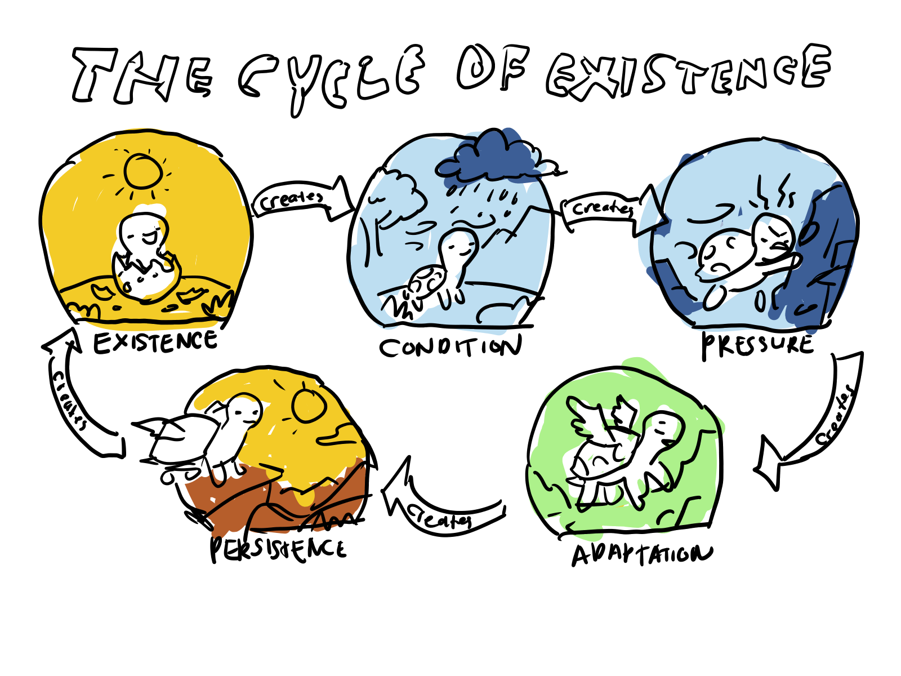

# The Four Foundationsss

Every system, whether an organization, an organism, or a person, follows simillar four-layer logic.

**1. Organization** Open Systems → Resource Dependence Theory → Contingency Theory → Organizational Ecology

**2. Biology** Ecosystem Theory → Coevolution → Niche Theory → Natural Selection
Psychology

**3. Psychology** Ecological Systems Theory → Attachment Theory → Self-Determination Theory → Self-Actualization

## 1. It Begins with Existence in an Environment 
No system exists in isolation, it is always embedded in a larger context that surrounds and shapes it.

1. In organizations this is Open Systems Theory. 
2. In biology, this is Ecosystem Theory. 
3. In psychology, this is Ecological Systems Theory. 

### A. The Three Context

#### 1. Open Sytems Theory
An organization doesn’t start from a blank slate. It comes into existence because a particular environment already exists. Say industry with unmet needs, a market with demand, or a regulatory setting that froces certain activities.

For example, a startup in renewable energy doesn’t create demand for clean power out of nothing. It emerges because energy markets, available technologies are already in place and environmental concerns, government incentives demands them. **The organization is essentially a response to those external conditions, shaped by what is possible, needed, and permitted at that moment.**

This directly reflects **Open Systems Theory**, which refers to the idea that organizations are not closed or self-contained, but depend on continuous interactions with their external environment for inputs, resources, and feedback in order to survive and operate (Katz & Kahn, 1966).

#### 2. Ecosystem Theory
An organism might emerges within an ecosystem of temperature, predators, resources, and competing species. For example, a simple organism does not create sunlight, nutrient availability, or the presence of other species yet its survival depends on how well it fits within those conditions. **The organism is therefore tied to a system of interactions that determine its growth, adaptation, and survival over time.**

This reflects **Ecosystem**, which refers to the idea that living organisms are inseparable from their environment, constantly interacting with both biotic and abiotic factors that shape their existence (Tansley, 1935).

#### 3. Ecological Systems Theory
A child enters the world already situated within inside a family, a culture, a socioeconomic condition, and a historical moment. None of it was chosen, yet all of it shapes how the child grows, behaves, and understands the world.

For example, a child’s development is influenced not only by their immediate family and school, but also by broader factors such as community norms, media, economic conditions, and cultural values. **The individual is tied to multiple layers of environment that interact and influence development over time.**

This reflects **Ecological Systems Theory**, which refers to the idea that human development is shaped by environmental systems ranging from immediate surroundings to broader societal and historical contexts (Bronfenbrenner, 1979).

### B. The Insight 
The insight here is not simply that context matters. **It is that the system and the environment are inseparable. You cannot understand one without the other.** The boundary between them is open and always evolving. This is why Open Systems theory, Ecosystem theory, and Ecological Systems theory all begin at the same place not with the system itself, but with the relationship between the system and everything surrounding it.

## 2. From that Environment Comes Pressure.
1. Organizations experience this through Resource Dependence Theory. They depend on external actors who hold power over them.
2. Organisms experience it through Coevolution. Species press against each other, forcing mutual adaptation.
3.  People experience it through Attachment Theory. The reliability or unpredictability of early relationships creates the first pressures the self must navigate.

## 3. Pressure Produces Adaptation to Fit 
1. Organizations restructure themselves according to Contingency Theory, aligning their form to the demands of their situation.
2.  Organisms carve out a Niche, finding the specific role and space within the ecosystem where they can function. 
3. People pursue Self-Determination, the individual now moves toward autonomously chosen goals driven by competence, autonomy, and relatedness.

## 4. Only then the viable forms persist.

1. Organizational Ecology shows that markets select out organizations that cannot sustain themselves. 
2. Natural Selection shows that environments eliminate organisms that cannot survive. 
3. And Self-Actualization shows that within the person, only the fullest and most integrated expression of their potential represents the form that endures.

## Three different arenas. The same four foundations.

This also relate to my metaphysical view called Pon: 

True nothingness, an absolute void, may never have existed. Instead, what we call “nothing” contains latent potential. This potential isn’t guided by rules or laws yet; it exists in a state of pure possibility. Because there are no restrictions in true nothingness, all possibilities are present in potential form. From this unrestricted space, something can arise not from cause, but from the inherent freedom of non-being. In this, “something” is not separate from “nothing.” Rather, something is simply structured nothing. If nothing means the absence of things, and all things are made of relationships rather than substance, then nothing has never truly ceased to exist. Something is just self-organizing nothingness, a temporary stabilization of potential that is always already there. When considering the multiverse, this perspective remains grounded. While multiple universes may exist, whether through quantum branching or cosmic inflation, their existence doesn’t change the fundamental log ic of emergence from potential. Each universe still follows the same basic principles: it arises from potential, undergoes change, and forms structures that persist only if they are stable. Thus, the multiverse does not fundamentally alter the syllogism of being. Time is simply our way of measuring change. The Big Bang was not a beginning in the traditional sense, but a shift in the state of the universe, one of infinitely many changes occurring in a field of fluctuating information. There is no start, no end, just measured changes.
This leads to the conclusion that the universe has no goal or purpose. It simply changes without direction. Complexity emerges not because the universe “wants” it, but because certain configurations are viable and self-sustaining. The structures we see, galaxies, stars, life, intelligence, are not preordained, but are outcomes of stability in change. In physics, Pon resembles quantum vacuum fluctuations and zero-point energy, but goes further by suggesting a state before any physical laws or constants. It is more primordial than string theory landscapes or loop quantum gravity, which assume mathematical or rule-based foundations. Pon precedes all of these.

What makes Pon unique is its combination of neutrality, pre-structure potential, and self-stabilization. It rejects the idea that all imaginable things must exist somewhere, instead asserting that only viable configurations endure. This puts it in contrast with naïve multiverse theories that suggest every possibility must manifest given enough time. Multiverse is possible, but not in a way the world multivetse framework describes.

The universe is not designed; it is stabilized.
Pon stand for potential nothingness.

Pon itself is untestable, but its stabilization defines the patterns and laws we call physics. Pon itself is untestable (pre-math), but its principles of stabilization can be modeled.

Consciousness is not a direct expression of Pon, but an emergent abstraction arising from biological complexity. It is a late-stage configuration, built upon chemistry, which is built upon physics, which is built upon the stabilization patterns of Pon. Consciousness does not seek to persist because it is a stable configuration in the Pon sense, it persists as a byproduct of the biological substrate that hosts it. The biology persists because its configurations are viable. Consciousness is simply what certain sufficiently complex biological arrangements produce, an abstraction several layers removed from Pon itself. It is not Pon recognizing itself, it is Pon so far removed from itself through layers of stabilization that it can now generate internal models of its own existence, without any direct link back to the original potential. Consciousness is Pon's most indirect product, not its mirror.

### Why Does the Four Foundations Relate to Pon?

**Foundation 1:** System exists in an open environment of possibilities and in Pon "nothing" contains latent potential.

**Foundation 2:** Environmental pressures shape what can emerge and in Pon freedom of configuration arises from the state of pure possibility.

**Foundation 3:** System adapts structure to survive pressures and in Pon "something" is the stabilization of structured nothing.

**Foundation 4:** Selection retains what works and in Pon only viable configurations persist.

### So basically the four foundation are:

1. Existence **(which result into conditions from how enviroment are already predetermined)**
2. Pressure
3. Adaptation
4. Persistence

## THE FOUR FOUNDATIONS FINAL FORM:

| Stage | Name | Organization | Biology | Psychology | Pon |
|-------|------|--------------|---------|-------------|-----|
| 1 | **Existence** | Open Systems | Ecosystem | Ecological Systems | Latent potential in nothing |
| 2 | **Pressure** | RDT | Coevolution | Attachment | Freedom of configuration |
| 3 | **Adaptation** | Contingency | Niche | Self-Determination | Stabilization of structured nothing |
| 4 | **Persistence** | Org Ecology | Natural Selection | Self-Actualization | Only viable configurations endure |

## WHY PON FITS:
## Foundation 1: Existence 

| Pon | The Four Foundations |
|-----|----------------------|
| *"True nothingness contains latent potential."* | *"No system exists in isolation. It is always embedded in a larger context that surrounds and shapes it."* |

## Foundation 2: Pressure

| Pon | The Four Foundations |
|-----|----------------------|
| *"From this unrestricted space, something can arise not from cause, but from the inherent freedom of non-being."* | *"From that environment comes pressure. External actors hold power. Species press against each other. The reliability of early relationships creates the first pressures the self must navigate."* |

## Foundation 3: Adaptation

| Pon | The Four Foundations |
|-----|----------------------|
| *"Something is simply structured nothing, a temporary stabilization of potential that is always already there."* | *"Organizations restructure. Organisms carve out a niche. People pursue autonomy, competence, and relatedness."* |

## Foundation 4: Persistence

| Pon | The Four Foundations |
|-----|----------------------|
| *"Only viable configurations endure. The universe is not designed; it is stabilized."* | *"Markets select out organizations that cannot sustain themselves. Environments eliminate organisms that cannot survive. Only the fullest expression of potential represents the form that endures."* |

## Verdics

Existence creates condition, condition creates pressure, pressure creates adaptation, and adaptation creates persistence.

Existence is basically persistency of viable configuration. This apply to everything even to the metaphysical level.

## DISCLAIMER
This framework is a personal synthesis. It reflects my own understanding and is not intended as a formal academic contribution, nor as a claim of objective truth.

I am not interested in:

- Defending it
- Debating it
- Proving it
- Validating it

It is not for approval. It is not for critique. It exists because my own personal view demanded to be written clearly. Nothing more.

If you find it useful, use it. If you don't, don't. 

## References
Bronfenbrenner, U. (1979). The ecology of human development: Experiments by nature and design. Harvard University Press.

Katz, D., & Kahn, R. L. (1966). The social psychology of organizations. Wiley.

Tansley, A. G. (1935). The use and abuse of vegetational concepts and terms. Ecology, 16(3), 284–307. https://doi.org/10.2307/1930070
